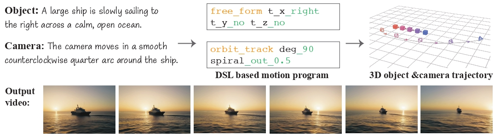

<p align="center">

<h1 align="center">LAMP: Language-Assisted Motion Planning</h1>
<p align="center">
    <strong>M. Burak Kizil</strong>
    ·
    <strong>Enes Sanli</strong>
    ·
    <strong>Niloy J. Mitra</strong>
    ·
    <strong>Erkut Erdem</strong>
    ·
    <strong>Aykut Erdem</strong>
    ·
    <strong>Duygu Ceylan</strong>
    <br>
    <br>
        <a href="https://arxiv.org/abs/2512.03619">arXiv</a>
        <a href="https://cyberiada.github.io/LAMP/">Webpage</a>
    <br>
</p>


## Introduction
<strong>LAMP</strong> defines a motion domain-specific language (DSL), inspired by cinematography conventions. By harnessing program synthesis capabilities of LLMs, LAMP generates structured motion programs from natural language, which are deterministically mapped to 3D trajectories.




## 🎉 News 
- [x] Dec 7, 2025: Gradio demo is ready to use. 
- [x] Dec 7, 2025: We propose [LAMP](https://cyberiada.github.io/LAMP/) 


## ⚙️ Installation
The codebase was tested with Python 3.11.13, CUDA version 12.8, and PyTorch >= 2.8.0

### Setup for Model Inference
You can setup for LAMP model inference by running:
```bash
git clone https://github.com/mbkizil/LAMP.git && cd LAMP
pip install torch==2.8.0 torchvision==0.23.0 --index-url https://download.pytorch.org/whl/cu128  # If PyTorch is not installed.
pip install -r requirements.txt
pip install wan@git+https://github.com/Wan-Video/Wan2.1  
```

## Download Models

Download the VACE and fine-tuned Qwen2.5-VL-7B-Instruct models using [download.sh](download.sh)
```bash
chmo +x download.sh
./download.sh
```

## 🚀 Usage
In LAMP, users act as a director, providing natural language descriptions for both object and camera behaviors. The system translates these prompts into precise 3D Motion Programs and conditions the video generation process to produce cinematic shots.

### Interactive Demo (Gradio)
To explore the full pipeline—from text-to-motion planning to final video synthesis—we provide an interactive Gradio interface. This single entry point handles the loading of the Motion Planner (Qwen2.5-VL) and the Video Generator (VACE) seamlessly.
```bash

python -m src.serve.app --model-path ./qwen_checkpoints/LAMP-Qwen-2.5-VL

```
This script will:

> Load the LLM Motion Planner (Qwen2.5-based) into memory.

> Initialize the embedded VACE pipeline for trajectory-conditioned generation.

> Launch a local web server (default at http://127.0.0.1:8890).

Once inside the UI, you can input prompts like "Object: A ship sailing right. Camera: Orbit smoothly around the ship" to see the generated DSL, 3D visualization, and final video side-by-side.


> 💡**Notes from VACE**: 
> (1) Please refer to [vace/vace_wan_inference.py](./src/vace_lib/vace/vace_wan_inference.py)  for the inference args.
> (2) For English language Wan2.1 users, you need prompt extension to unlock the full model performance. 
Please follow the [instruction of Wan2.1](https://github.com/Wan-Video/Wan2.1?tab=readme-ov-file#2-using-prompt-extension) and set `--use_prompt_extend` while running inference.


## Acknowledgement


We are grateful for the following awesome projects that served as the foundation for LAMP, including [VACE](https://github.com/ali-vilab/VACE) for the powerful all-in-one video generation backbone and [Qwen](https://github.com/QwenLM/Qwen3-VL?ref=xxzz.info) for the robust language reasoning capabilities. We also extend our thanks to [Qwen-VL-Series-Finetune](https://github.com/2U1/Qwen-VL-Series-Finetune), which provided an efficient framework for training our motion planner.

Additionally, we acknowledge the pioneering works in camera control and trajectory generation, specifically [GenDoP](https://github.com/3DTopia/GenDoP) and [Exceptional Trajectories](https://github.com/robincourant/DIRECTOR). Their contributions to motion datasets and evaluation methodologies have brought immense inspiration to this project and established essential baselines for the field of controllable video generation.

## BibTeX

```bibtex
@misc{kizil2025lamplanguageassistedmotionplanning,
    title={LAMP: Language-Assisted Motion Planning for Controllable Video Generation}, 
    author={Muhammed Burak Kizil and Enes Sanli and Niloy J. Mitra and Erkut Erdem and Aykut Erdem and Duygu Ceylan},
    year={2025},
    eprint={2512.03619},
    archivePrefix={arXiv},
    primaryClass={cs.CV},
    url={https://arxiv.org/abs/2512.03619}, 
}